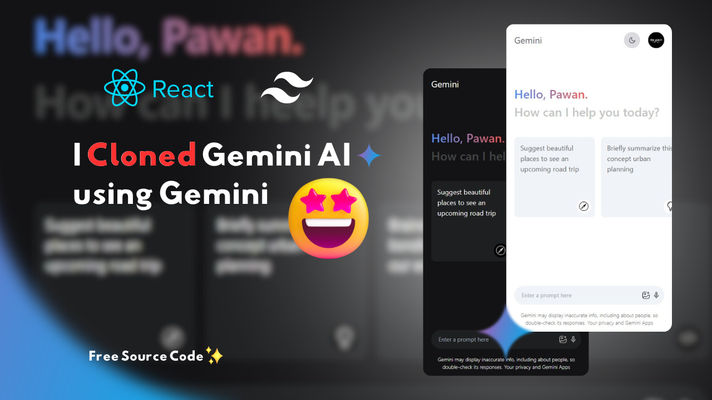

## Gemini Clone ⚡️

This repository contains a React JSX app that implements a responsive and theme-switchable clone of the Gemini social network.

### [Preview Gemini Clone ⭐️](https://gemini-clone-henna.vercel.app/)
#### 

### Features

* **Responsive Design:** The app adapts seamlessly to different screen sizes, ensuring optimal user experience on desktops, tablets, and mobile devices.
* **Dark/Light Theme:** Users can switch between a dark and light theme to customize their viewing preferences.
* **Gemini-Inspired UI:** The app closely resembles the look and feel of the Gemini social network, providing a familiar and intuitive interface for Gemini users.

### Getting Started

1. **Clone the Repository:**

   ```bash
   git clone [repository-link]

2. **Install Dependencies:**
   ```bash
   cd gemini-clone
   npm install
   npm install react-icons
   npm install use-local-storage
3. **Install Tailwind CSS for vite**


4. **Start the Development Server:**
   ```bash
   npm run dev

This will launch the app in development mode, usually accessible at http://localhost:5173/ in your web browser.
### Usage
Once the development server is running, you can interact with the app locally and make changes to the source code.
* **Theme Switching:** The app provides a mechanism for users to toggle between dark and light themes. This functionality can be implemented using various approaches, such as:
 * **React Context API:** Create a global state management solution using React's Context API to store the current theme and provide it to components throughout the app. Components can then conditionally render styles based on the theme context.
 * **Local Storage:** Store the preferred theme in the user's browser's local storage, allowing the app to remember theme preferences across sessions.
 * **Third-Party Libraries:** Consider using established libraries like styled-components or emotion to simplify theme management and provide features like theme switching.

### Contributing
We welcome contributions to this project! Feel free to open pull requests with your enhancements or bug fixes.
License
This project is licensed under the MIT License. See the LICENSE file for details.
Additional Notes
 * This readme.md file serves as a starting point. You may need to customize it further based on your specific implementation details and preferences.
 * Consider providing more details about the theme switching functionality and its implementation in the readme file.
 * You can add screenshots or GIFs to showcase the app's functionality visually.

#### ***Give a ⭐️***
 ***This ReadMe.md raw code is also generated using this **Gemini Clone**.***
